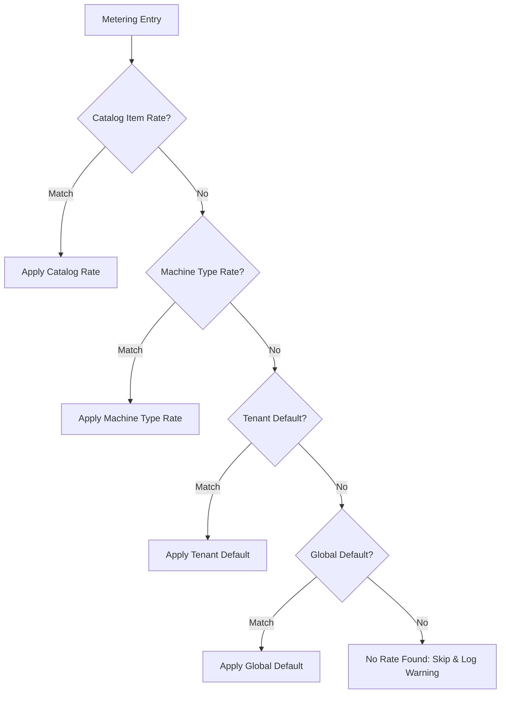

# Rate Configuration & Pricing Guide

How pricing works in the Cost Management PoC: rate forms, the two-tier rating architecture, static rate cards, graduated tiers, per-tenant overrides, programmable GoRules decision models, and rate assignment tools.

**See also:**
- [Metric Calculation Reference](metric-calculation-reference.md) — how raw meters are computed, catalog fallback, and worked examples from resource to dollar amount.
- [Cost Calculation Spec Draft](poc_architecture/pricing/cost-calculation-spec-draft.md) — underlying billing specification and Koku metric alignment.
- [API Reference](api-reference.md) — HTTP API endpoints including rates, quotas, reports, and UI tools.
- [Data Model](data-model.md) — full PostgreSQL schemas for `rates`, `pricing_rules`, `metering_entries`, and `cost_entries`.
- [GoRules Decision Logic & Diagrams](research/gorules-rule-diagrams.md) — decision graph node layouts and truth tables.
- [GoRules Integration Assessment](research/gorules-integration-assessment.md) — technical evaluation of the Rust/Zen decision engine.
- [GoRules Demo Walkthrough](demos/gorules-demo.md) — step-by-step interactive demo running against OSAC.
- [Bruno Collection](../bruno-collection/) — clickable API request collection including the `Rates/` folder.

---

## 1. Rating Architecture Overview

The rating engine in `inventory-watcher/internal/rating/rating.go` converts unrated `metering_entries` into billable `cost_entries`. It operates as a **two-tier architecture**:

```
                         Unrated Metering Entry
                                  │
                                  ▼
               ┌──────────────────────────────────────┐
               │ Tier 1: Programmable Decision Engine │
               │   (GoRules / Zen JSON Decision Graph)│
               └──────────────────┬───────────────────┘
                                  │
                       Matched? ──┴── No / Error / Unconfigured
                          │                       │
                         Yes                      ▼
                          │         ┌───────────────────────────┐
                          │         │ Tier 2: Static Rate Cards │
                          │         │     (PostgreSQL rates)    │
                          │         └─────────────┬─────────────┘
                          │                       │
                          │            4-way Fallback Match
                          │            (Tenant + SKU > SKU > ...)
                          │                       │
                          ▼                       ▼
                    Calculate Cost          Calculate Cost
                  (Rules Expression)     (Flat / Tier Waterfall)
                          │                       │
                          └───────────┬───────────┘
                                      │
                                      ▼
                            Insert Cost Entry
                            (PostgreSQL cost_entries)
```

1. **Tier 1 (Programmable Decision Engine):** Evaluated first via `r.tryRuleEngine()`. If a matching rule exists (e.g. `compute-pricing.json`), GoRules evaluates multi-dimensional policies (e.g. instance type combined with tenant tier discounts or committed-use utilization brackets).
2. **Tier 2 (Static Rate Cards):** If no programmable rule matches or GoRules is disabled, the rating sweep falls back to `matchRate()` on the `rates` table using a 4-way fallback hierarchy. Cost is computed using either flat multiplication or graduated tier waterfalls.

---

## 2. Rate Forms & Capabilities Comparison

The PoC supports four distinct rate forms across its two rating tiers:

| Rate Form | Engine Layer | Stored In | Best Used For | Example |
| :--- | :--- | :--- | :--- | :--- |
| **Flat Rate** | Static (`rates`) | `rates.price_per_unit` | Direct linear pricing per SKU or meter unit | `$0.20 / VM-hour`, `$1.50 / M tokens` |
| **Per-Tenant Rate** | Static (`rates`) | `rates.tenant_id` | Negotiated contracts and tenant-specific discounts | Tenant `tenant-acme` pays `$0.15/hr` instead of `$0.20/hr` |
| **Tiered (`per_event`)** | Static (`rates`) | `rates.tiers` (JSONB) | Independent graduated pricing per transaction/request | Large MaaS inference requests where tier resets each call |
| **Tiered (`cumulative`)** | Static (`rates`) | `rates.tiers` + `rates.tier_period` | Monthly or windowed volume/capacity tiers with free allowance | First 20 GiB memory free/month, then `$0.08/GiB`, then `$0.07/GiB` |
| **Programmable (GoRules)** | Rule Engine (Zen) | `pricing_rules` table | Multi-factor logic, commitment agreements, and tenant tier labels | `standard-4-16` + `gold` tier label → 20% discount; CUD overage → sustained use |

---

## 3. Tier 1: Programmable Pricing with GoRules (Zen Engine)

### Why Programmable Rules?

Scalar rate tables work well for `quantity × rate` lookups. However, real enterprise cloud pricing frequently requires **multi-factor decision logic**:
- Tenant tier discounts derived from metadata or labels (e.g. `cost-mgmt/tier=gold`).
- Committed-Use Discounts (CUD) with sustained-use fallbacks based on monthly utilization %.
- Business policies that change without modifying Go code or redeploying binaries.

The PoC embeds **GoRules/Zen** (`github.com/gorules/zen-go`), a compiled Rust decision engine with sub-microsecond evaluation performance.

### Implemented Rules

The consumer includes two battle-tested JSON Decision Models (JDMs) in `inventory-watcher/rules/`:

#### 1. Instance Type with Tenant Tier (`compute-pricing.json`)
Evaluates a decision table mapping `(catalog_item, instance_type, tenant_tier)` to base price and discount. Catalog-specific rows are evaluated first; blank catalog cells preserve the existing instance-type behavior:

```
┌──────────────────┐     ┌────────────────────────────────┐     ┌────────────────┐
│      Input       │────▶│    Instance Type Rate Matrix   │────▶│  Final Cost    │
│  catalog_item    │     │ catalog SKU → dedicated price  │     │  (Expression)  │
│  instance_type   │     │ standard-4-16 + gold → 20% off │     │                │
│  tenant_tier     │     │ standard-4-16 + any  →  0% off │     │                │
│  value (seconds) │     │ standard-4-16 + any  →  0% off │     │ value/3600     │
└──────────────────┘     └────────────────────────────────┘     │   × $/hr       │
                                                                │   × (1 - disc) │
                                                                └────────────────┘
```

* **Inputs:** `catalog_item`, `instance_type`, `tenant_tier` (from tenant OSAC labels), and `value` (uptime seconds).
* **Outputs:** `cost_amount`, `effective_rate`, `currency`, `description`.
* **Examples:** `catalog-live-vm-standard` is priced at $0.30/hr by a catalog-specific GoRule row. `standard-4-16` has a base rate of $0.20/hr and is billed at $0.16/hr for a tenant with `tier=gold`.

#### 2. Committed-Use & Sustained-Use Disounts (`committed-use-pricing.json`)
A multi-node decision graph chaining three evaluation stages:
1. **CUD Agreement Lookup:** Looks up committed VM quota and discount for the tenant (e.g. Acme committed 5 VMs at 40% discount).
2. **Sustained-Use Tiering:** If running VMs exceed commitment, evaluates monthly utilization % (≥ 75% gets 20% discount, ≥ 50% gets 10%, etc.).
3. **Calculation Expression Node:** Selects CUD rate if within commitment, sustained-use rate if over commitment, or on-demand rate if uncommitted.

See [GoRules Decision Logic & Diagrams](research/gorules-rule-diagrams.md) for full flowcharts and truth tables.

### Storage & Hot-Reloading

GoRules uses the database-backed `pricing_rules` table. The bundled JDM files seed missing rows when a new database is initialized; existing rows are never overwritten on restart, so database edits remain authoritative:

1. **Database-backed (`pricing_rules` table):**
   ```sql
   CREATE TABLE pricing_rules (
       id         BIGSERIAL PRIMARY KEY,
       name       TEXT NOT NULL UNIQUE,
       rule_json  JSONB NOT NULL,
       version    INTEGER NOT NULL DEFAULT 1,
       created_at TIMESTAMPTZ NOT NULL DEFAULT NOW(),
       updated_at TIMESTAMPTZ NOT NULL DEFAULT NOW()
   );
   ```
   * On every rating sweep, `ReloadIfChanged(ctx)` queries `SELECT COALESCE(SUM(version), 0) FROM pricing_rules`.
   * When updated, the in-memory Zen engine cache reloads immediately **with zero downtime and without service restarts**.

---

## 4. Tier 2: Static Rate Cards (`rates` table)

### OSAC Pricing Model: Catalog Item and Machine Type

OSAC `ComputeInstance` events carry two independent pricing dimensions: `catalog_item_id` identifies the catalog offering/SKU, while `billing_dimensions.instance_type` identifies the underlying machine shape (for example, `standard-4-16` or `m5.xlarge`). The receiver preserves both dimensions; catalog-specific pricing must not overwrite the machine type.

**Recommended setup:**
1. Configure one rate per catalog item on the `vm_uptime_seconds` meter when offerings have distinct prices.
2. Use `instance_type` when the machine shape itself determines the price, independent of catalog offering.
3. Set CPU/memory meter rates to $0 so they emit zero-cost entries (useful for capacity reporting without affecting customer invoices).

```sql
-- Per-instance-type pricing: each SKU has its own hourly rate ($/3600 per second)
INSERT INTO rates (resource_type, instance_type, meter_name, cost_type, price_per_unit, currency, description)
VALUES
  ('compute_instance', 'standard-2-8',  'vm_uptime_seconds', 'Infrastructure', 0.10 / 3600, 'USD', '2 vCPU, 8 GiB ($0.10/hr)'),
  ('compute_instance', 'standard-4-16', 'vm_uptime_seconds', 'Infrastructure', 0.20 / 3600, 'USD', '4 vCPU, 16 GiB ($0.20/hr)'),
  ('compute_instance', 'standard-8-32', 'vm_uptime_seconds', 'Infrastructure', 0.40 / 3600, 'USD', '8 vCPU, 32 GiB ($0.40/hr)');

-- Zero-rate CPU/memory meters for capacity tracking only
INSERT INTO rates (resource_type, instance_type, meter_name, cost_type, price_per_unit, currency)
VALUES
  ('compute_instance', '', 'vm_cpu_core_seconds',   'Supplementary', 0, 'USD'),
  ('compute_instance', '', 'vm_memory_gib_seconds', 'Supplementary', 0, 'USD');
```

### Rate Matching Logic

When matching an unrated metering entry against the static `rates` table, the engine prefers catalog-specific rates, then machine-type rates, then tenant and global defaults. Existing rates that stored a catalog SKU in `instance_type` remain supported as a compatibility fallback.



1. **Tenant + Catalog Item:** e.g. a negotiated contract for `tenant-acme` on `vm-standard`.
2. **Catalog Item:** e.g. a global rate for `vm-standard` across all tenants.
3. **Tenant + Machine Type / Machine Type:** shape-specific pricing such as `standard-8-32`.
4. **Tenant-only / Global default:** fallback rates where both dimensions are empty.

### Per-Tenant Pricing Overrides

To give a VIP tenant a negotiated discount on a SKU:

```sql
-- Global baseline: $0.50/hr
INSERT INTO rates (resource_type, instance_type, meter_name, cost_type, price_per_unit, currency)
VALUES ('compute_instance', 'standard-4-16', 'vm_uptime_seconds', 'Infrastructure', 0.50 / 3600, 'USD');

-- Negotiated override for tenant-acme: $0.30/hr
INSERT INTO rates (tenant_id, resource_type, instance_type, meter_name, cost_type, price_per_unit, currency)
VALUES ('tenant-acme', 'compute_instance', 'standard-4-16', 'vm_uptime_seconds', 'Infrastructure', 0.30 / 3600, 'USD');
```

### Model-as-a-Service (MaaS) Rates

MaaS meters charge per unit of token inference consumed rather than provisioned uptime:

```sql
INSERT INTO rates (resource_type, meter_name, cost_type, price_per_unit, currency, description)
VALUES
  ('model', 'maas_tokens_in',  'Supplementary', 0.50 / 1000000, 'USD', 'Prompt tokens (includes cached)'),
  ('model', 'maas_tokens_out', 'Supplementary', 1.50 / 1000000, 'USD', 'Completion tokens (includes reasoning)'),
  ('model', 'maas_requests',   'Supplementary', 5.00 / 1000000, 'USD', 'API request calls');
```

---

## 5. Tiered Pricing (Graduated & Cumulative)

Tiers are stored as a JSONB array on the `rates` table:
```json
[
  {"up_to": 20, "price_per_unit": 0},
  {"up_to": 120, "price_per_unit": 0.08},
  {"up_to": null, "price_per_unit": 0.07}
]
```

### Mode 1: Per-Event Tiers (`tier_mode = 'per_event'`)
Each single metering entry is evaluated through the tier ladder independently. Useful for large single batch inference jobs where each request has its own tier structure.

### Mode 2: Cumulative Tiers (`tier_mode = 'cumulative'`)
Usage accumulates over a specified billing window (`tier_period`, e.g. `'monthly'`, `'5h'`, `'7d'`). The rating engine calculates marginal cost based on prior cumulative consumption:

```
Cost = applyTieredRate(prior_usage + current_value) - applyTieredRate(prior_usage)
```

```sql
-- Monthly memory tiers: First 20 GiB free, then graduated pricing
INSERT INTO rates (resource_type, meter_name, cost_type, price_per_unit, currency,
                   tier_mode, tier_period, tiers, description)
VALUES (
  'compute_instance', 'vm_memory_gib_seconds', 'Supplementary', 0, 'USD',
  'cumulative', 'monthly',
  '[{"up_to": 20, "price_per_unit": 0},
    {"up_to": 120, "price_per_unit": 0.08},
    {"up_to": null, "price_per_unit": 0.07}]',
  'First 20 GiB free/month, then graduated'
);
```

### Supported Billing Periods (`tier_period`)

| Value | Window Duration | Window Alignment |
| :--- | :--- | :--- |
| `"monthly"` (default) | Calendar month | 1st of month at 00:00 UTC |
| `"weekly"` | ISO week | Monday at 00:00 UTC |
| `"daily"` | Calendar day | Midnight 00:00 UTC |
| `"Nh"` (e.g. `"5h"`, `"8h"`) | N-hour slots | Anchored to midnight UTC |
| `"Nd"` (e.g. `"7d"`, `"10d"`) | N-day slots | Anchored to 1st of month |

---

## 6. Monetary Budgets & Spend Caps

A spend budget is defined as a quota where `unit` is set to a currency code (`USD`, `EUR`) and `meter_name = '*'`:

```sql
-- Monthly $5,000 spend cap across all meters for tenant-acme
INSERT INTO quotas (name, tenant_id, meter_name, limit_value, unit, period)
VALUES ('Monthly spend cap', 'tenant-acme', '*', 5000, 'USD', 'monthly');
```

When evaluated, the quota status queries total accumulated dollars from `cost_entries` instead of raw usage units, firing alerts at configured thresholds (e.g. 50%, 70%, 90%, 100%).

---

## 7. How to Assign & Manage Rates

Rates can be managed using three interfaces depending on the workflow:

### 1. Interactive Web UI (`/ui/rates`)

The embedded Catalog & Rates tool at `http://localhost:8020/ui/rates` provides a browser-based management interface:
- **Synchronized Catalog View:** Lists machine instance types (vCPU, memory GiB) and OSAC catalog offerings.
- **Assigned Rate Status:** Shows the effective rate card assigned to each sizing spec.
- **Inline Rate Assignment Modal:** Allows selecting a catalog SKU, specifying an hourly rate ($/hr) or direct unit rate, adding descriptions, and configuring cost types.
- **Active Rate Cards Table:** Displays all active rates, their fallback precedence, and provides single-click **Delete** buttons.
- **CSV Export:** One-click download of the complete active rate card table.

### 2. REST API (`/api/v1/rates`)

The REST API enables programmatic rate card management (defined in `docs/openapi.yaml`):

#### List Rates
```http
GET /api/v1/rates HTTP/1.1
Host: localhost:8020
```
* **Filter by tenant:** `GET /api/v1/rates?tenant_id=tenant-acme` returns tenant-specific overrides plus global defaults.
* **CSV export:** `GET /api/v1/rates?format=csv` downloads rate cards as a CSV file.

#### Create or Update Rate
```http
POST /api/v1/rates HTTP/1.1
Host: localhost:8020
Content-Type: application/json

{
  "resource_type": "compute_instance",
  "catalog_item": "vm-standard",
  "instance_type": "standard-4-16",
  "meter_name": "vm_uptime_seconds",
  "cost_type": "Infrastructure",
  "price_per_unit": 0.00005555555555555556,
  "currency": "USD",
  "description": "Standard 4-core 16GB VM ($0.20/hour)"
}
```

#### Delete Rate
```http
DELETE /api/v1/rates/12 HTTP/1.1
Host: localhost:8020
```

### 3. Bruno API Collection

Ready-to-run requests are checked into the repository under [`bruno-collection/Rates/`](../bruno-collection/):
- **`List Rates (JSON)`**: Fetches all rates with optional tenant filtering.
- **`List Rates (CSV)`**: Downloads the active rate table as CSV.
- **`Create Rate`**: Post a new rate definition with pre-calculated unit prices.
- **`Delete Rate`**: Delete a rate card by ID.

---

## 8. Database Schema Reference

```
rates
├── id              BIGSERIAL PRIMARY KEY
├── tenant_id       TEXT          -- NULL / empty = applies to all tenants
├── resource_type   TEXT NOT NULL -- 'compute_instance', 'cluster', 'model', 'bare_metal'
├── catalog_item    TEXT NOT NULL -- Catalog offering name (e.g. 'vm-standard'); empty = all
├── instance_type   TEXT NOT NULL -- SKU / sizing spec name (e.g. 'standard-4-16'); empty = all
├── meter_name      TEXT NOT NULL -- 'vm_uptime_seconds', 'maas_tokens_in', etc.
├── koku_metric     TEXT NOT NULL -- Optional Koku metric mapping
├── cost_type       TEXT NOT NULL -- 'Infrastructure' or 'Supplementary'
├── price_per_unit  NUMERIC(18,10)-- Stored pre-converted to meter SI unit
├── currency        TEXT NOT NULL -- 'USD'
├── tiers           JSONB         -- Optional array of graduated price bands
├── tier_mode       TEXT NOT NULL -- 'per_event' or 'cumulative'
├── tier_period     TEXT NOT NULL -- Window for cumulative tiers: 'monthly', '5h', etc.
├── description     TEXT NOT NULL
├── effective_from  TIMESTAMPTZ NOT NULL DEFAULT NOW()
└── effective_to    TIMESTAMPTZ   -- NULL = indefinitely active

pricing_rules
├── id              BIGSERIAL PRIMARY KEY
├── name            TEXT NOT NULL UNIQUE -- Rule file name (e.g. 'compute-pricing.json')
├── rule_json       JSONB NOT NULL       -- JDM decision graph definition
├── version         INTEGER NOT NULL     -- Incremented on edit for zero-downtime hot-reload
├── created_at      TIMESTAMPTZ NOT NULL
└── updated_at      TIMESTAMPTZ NOT NULL
```
